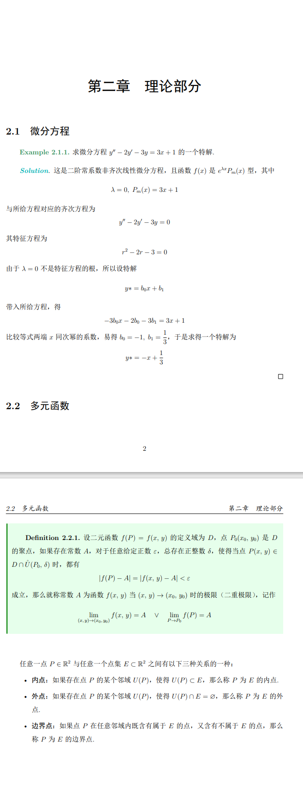

# LaTex模板

## 1.前言

### 1.1想说的话

由于笔者平时有用LaTex书写数学笔记及编写论文的需求，希望能够编写一个简单的模板，供笔者和感兴趣的读者使用。模板内容主要参考https://zhuanlan.zhihu.com/p/604236564 ，笔者在此基础上进行微调，使模板结构更加清晰易用。

2024.1.4补充：增加了试卷解答模板和知乎书写模板。

### 1.2运行环境

运行环境选用的是最常见的发行**Texlive**，编辑器采用**vscode**。接着给出vscode配置Latex的关键文件**settings.json**，帮助大家更好地构建一个完整的LaTex项目。

### 1.3配置文件

在配置文件中出现了几种编译链，我们在下面对其进行一一说明。

对于基本的文件编译，选择**xelatex**即可；

对于需要生成目录或引用公式的文件编译，选择**xelatex*2**；

对于生成完整的文章（目录，公式，文献引用），选择 **xelatex -> bibtex -> xelatex*2**。

```json
"latex-workshop.latex.autoBuild.run": "onSave",
    "latex-workshop.showContextMenu": true,
    "latex-workshop.intellisense.package.enabled": true,
    "latex-workshop.message.error.show": false,
    "latex-workshop.message.warning.show": false,
    "latex-workshop.latex.tools": [
        {
            "name": "xelatex",
            "command": "xelatex",
            "args": [
                "-synctex=1",
                "-interaction=nonstopmode",
                "-file-line-error",
                "%DOCFILE%"
            ]
        },
        {
            "name": "pdflatex",
            "command": "pdflatex",
            "args": [
                "-synctex=1",
                "-interaction=nonstopmode",
                "-file-line-error",
                "%DOCFILE%"
            ]
        },
        {
            "name": "latexmk",
            "command": "latexmk",
            "args": [
                "-synctex=1",
                "-interaction=nonstopmode",
                "-file-line-error",
                "-pdf",
                "-outdir=%OUTDIR%",
                "%DOCFILE%"
            ]
        },
        {
            "name": "bibtex",
            "command": "bibtex",
            "args": [
                "%DOCFILE%"
            ]
        }
    ],
    "latex-workshop.latex.recipes": [
        {
            "name": "XeLaTeX",
            "tools": [
                "xelatex"
            ]
        },
        {
            "name": "xelatex*2",
            "tools": [
                "xelatex",
                "xelatex"
            ]
        },
        {
            "name": "PDFLaTeX",
            "tools": [
                "pdflatex"
            ]
        },
        {
            "name": "BibTeX",
            "tools": [
                "bibtex"
            ]
        },
        {
            "name": "LaTeXmk",
            "tools": [
                "latexmk"
            ]
        },
        {
            "name": "xelatex -> bibtex -> xelatex*2",
            "tools": [
                "xelatex",
                "bibtex",
                "xelatex",
                "xelatex"
            ]
        },
        {
            "name": "pdflatex -> bibtex -> pdflatex*2",
            "tools": [
                "pdflatex",
                "bibtex",
                "pdflatex",
                "pdflatex"
            ]
        },
    ],
    // 用于在构建的时候把不需要的.out环境和log删除
    "latex-workshop.latex.autoClean.run": "onBuilt", 
    //这里代表删除类型，不能配置gz那个文件，因为这用于tex和pdf的双向同步
    "latex-workshop.latex.clean.fileTypes": [
        "*.aux",
        "*.bbl",
        "*.blg",
        "*.idx",
        "*.ind",
        "*.lof",
        "*.lot",
        "*.out",
        "*.toc",
        "*.acn",
        "*.acr",
        "*.alg",
        "*.glg",
        "*.glo",
        "*.gls",
        "*.ist",
        "*.fls",
        "*.log",
        "*.fdb_latexmk"
    ],
    "latex.linter.enabled": false,
    "latex-workshop.latex.recipe.default": "lastUsed",
    "latex-workshop.view.pdf.internal.synctex.keybinding": "double-click",
```


## 2基本文件目录

### 2.1配置文件

这是全局的配置文件，对应着config文件夹下的五个配置文件，分别是custom、format、package、theorem、config。

其中**config.tex**是总的配置文件，集成了其他四个配置文件的信息。

**custom.tex**文件中配置的是一些自己顺手的宏定义。

**format.tex**文件中配置了文章的格式如字体大小、行间距、列表格式等。请注意： **\graphicspath**是图形文件搜索路径指令，不能使用通配符来进行路径的配置，默认为 **\graphicspath{ {cover/figure/},{figure/}}** ，若每书写一个新的章节，建议在路径后面添加 **chap\*/figure** ，如 **\graphicspath{ {cover/figure/},{figure/},{chap1/figure/}}** 。

**package.tex**文件中配置了需要引用的宏包。请注意：这里不能使用 **unicode-math** 宏包，不然重定义的 **\boldsymbol** 指令会失效，并且基于 **\mathbb** 的数学符号会出现不可预知的问题。

**theorem.tex**文件中配置了定理、引理相关的环境。

### 2.2封面

由于是自用笔记模板，封面没做美化，就简单加了一个同济大学的logo，效果如下


### 2.3前言/摘要

这是封面接着的下一页内容。对应着**abstract/abstract.tex**。由于前言和摘要没有本质区别，若是写书或笔记使用**前言**作为标题，若是写论文使用**摘要**作为标题。效果如下


### 2.4章节

这是文章的主要内容，对应着**chap*/chap.tex**，并且给出下面的模板

```latex
\ifx\allfiles\undefined
\documentclass[12pt, a4paper, oneside, UTF8]{ctexbook}
\def\configPath{../config}
\input{\configPath/config}
\begin{document}
\else
\fi
% 在这里书写内容


% 在这里书写内容
\ifx\allfiles\undefined
\end{document}
\fi
```

这一部分不用过多赘述，按照模板正常书写即可。以下是部分页面展示




由于用LaTex手打列表过于复杂，在这里推荐一个笔者常用的web网页，来帮助大家更快地入门LaTex，并更加专注书写内容。

https://www.tablesgenerator.com/#

### 2.5 文献管理

这是文献管理部分，对应着**literature/literature.bib**文件，只需要在文件里面添加需要引用的文献，并在文章正文通过\cite命令引用即可。

## 3.编译

### 3.1单章节编译

由于文章分为多个章节，一起编译的时间很长，对于单独的章节，我们也提供了编译的选项。即使用**xelatex**或**xelatex*2**编译。

### 3.2多章节编译

在**main.tex**中使用**xelatex -> bibtex -> xelatex*2**编译即可。若出现编译错误，请查看日志文件，并尝试删除中间文件\*.bbl及\*.synctex.gz文件重新进行编译。

若不存在文献引用只需要选择**xelatex*2**进行编译即可。
